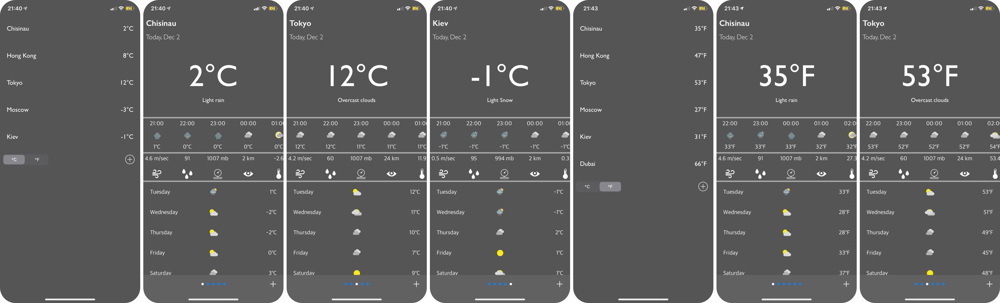
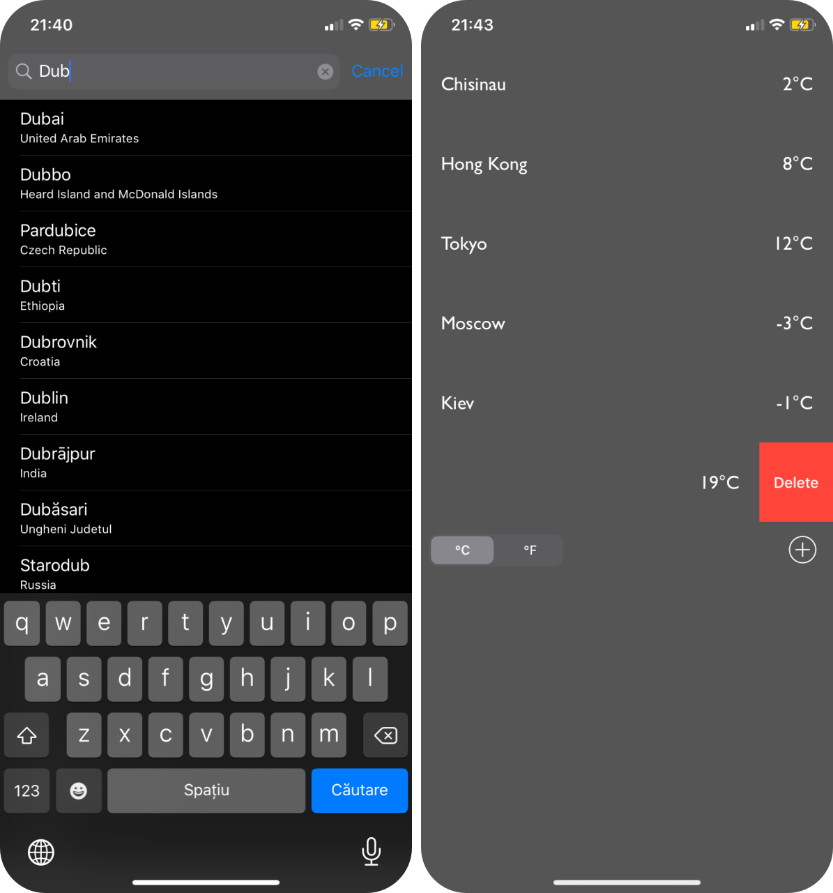

#  
<b>WeatherPlus</b>

:+1: You can see the weather forecast of the default cities. :shipit:

  <b>All cities available at the moment</b> 
  

:+1: You can add own cities delete only the cities which you added. :shipit:

<b>Add and delete a City</b> 

